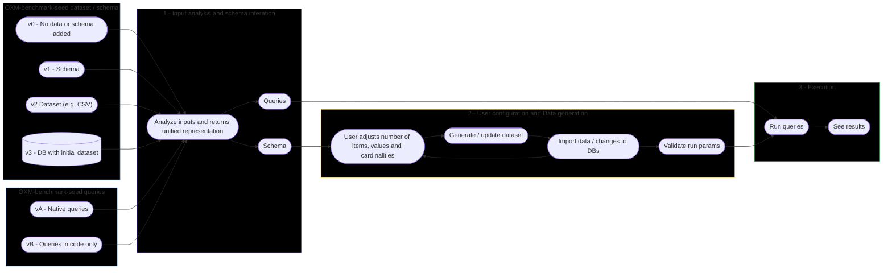

```mermaid

flowchart LR
    subgraph INPUTS_DATASET["OXM-benchmark-seed dataset / schema"]
        direction TD
        NOTHING(["v0 - No data or schema added"])
        SCHEMA(["v1 - Schema"])
        DATASET(["v2 Dataset (e.g. CSV)"])
        READONLY_DATABASE[("v3 - DB with initial dataset")]
    end

    subgraph INPUTS_QUERIES["OXM-benchmark-seed queries"]
        direction TD
        QUERIES(["vA - Native queries"])
        CODE_QUERIES(["vB - Queries in code only"])
    end

    subgraph SCHEMA_INFER["1 - Input analysis and schema inferation"]
        SCHEMA_ANALYSER(["Analyze inputs and returns unified representation"])
        INFERRED_SCHEMA(["Schema"])
        INFERRED_QUERIES(["Queries"])
        SCHEMA_ANALYSER --> INFERRED_SCHEMA
        SCHEMA_ANALYSER --> INFERRED_QUERIES
    end

    NOTHING --> SCHEMA_ANALYSER
    SCHEMA --> SCHEMA_ANALYSER
    DATASET --> SCHEMA_ANALYSER
    READONLY_DATABASE --> SCHEMA_ANALYSER
    QUERIES --> SCHEMA_ANALYSER
    CODE_QUERIES --> SCHEMA_ANALYSER

    INFERRED_SCHEMA --> ADJUST
    INFERRED_QUERIES --> RUN

    subgraph CONFIG["2 - User configuration and Data generation"]
        ADJUST(["User adjusts number of items, values and cardinalities"])
        GENERATE(["Generate / update dataset"])
        IMPORT(["Import data / changes to DBs"])
        ADJUST --> GENERATE
        GENERATE --> IMPORT
        IMPORT --> ADJUST
        VALIDATE(["Validate run params"])
    end

    subgraph EXECUTION["3 - Execution"]
        direction TD
        RUN(["Run queries"])
        RESULTS(["See results"])
        IMPORT --> VALIDATE --> RUN --> RESULTS
    end

    classDef input fill: #DBEAFE, stroke: #2563EB, color: #1E3A8A
    classDef init fill: #EDE9FE, stroke: #7C3AED, color: #4C1D95
    classDef config fill: #222222, stroke: #D97706, color: #78350F
    style INPUTS_DATASET fill: #000000, stroke: #93C5FD
    style INPUTS_QUERIES fill: #000000, stroke: #93C5FD
    style SCHEMA_INFER fill: #000000, stroke: #5027f1
    style CONFIG fill: #000000, stroke: #FCD34D
    style EXECUTION fill: #000000, stroke: #197629
```
