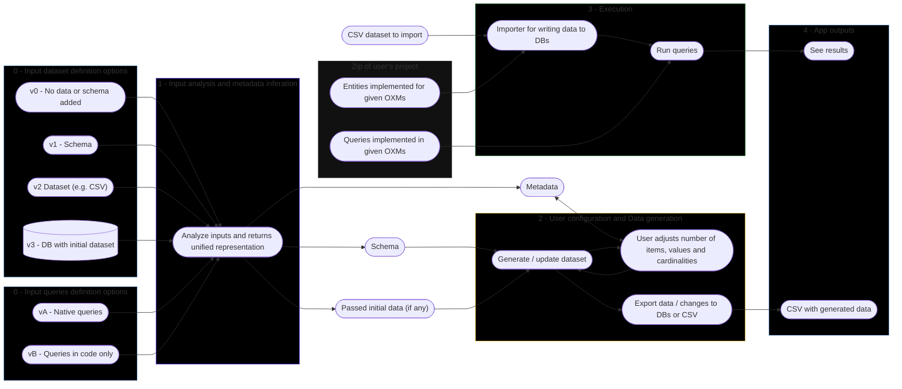

```mermaid

flowchart LR
    subgraph INPUTS_DATASET["0 - Input dataset definition options"]
        direction TD
        NOTHING(["v0 - No data or schema added"])
        SCHEMA(["v1 - Schema"])
        DATASET(["v2 Dataset (e.g. CSV)"])
        READONLY_DATABASE[("v3 - DB with initial dataset")]
    end

    subgraph INPUTS_QUERIES["0 - Input queries definition options"]
        direction TD
        QUERIES(["vA - Native queries"])
        CODE_QUERIES(["vB - Queries in code only"])
    end

    INFERRED_SCHEMA(["Schema"])
    INFERRED_METADATA(["Metadata"])
    INITIAL_DATA(["Passed initial data (if any)"])
    SCHEMA_ANALYSER --> INFERRED_SCHEMA
    SCHEMA_ANALYSER --> INFERRED_METADATA
    SCHEMA_ANALYSER --> INITIAL_DATA

    subgraph SCHEMA_INFER["1 - Input analysis and metadata inferation"]
        SCHEMA_ANALYSER(["Analyze inputs and returns unified representation"])
    end

    NOTHING --> SCHEMA_ANALYSER
    SCHEMA --> SCHEMA_ANALYSER
    DATASET --> SCHEMA_ANALYSER
    READONLY_DATABASE --> SCHEMA_ANALYSER
    QUERIES --> SCHEMA_ANALYSER
    CODE_QUERIES --> SCHEMA_ANALYSER

    INFERRED_SCHEMA --> GENERATE
    INITIAL_DATA --> GENERATE
    INFERRED_METADATA <--> ADJUST

    subgraph ZIP_PROJECT["Zip of user's project"]
        QUERIES_IN_CODE([Queries implemented in given OXMs])
        ENTITIES_IN_CODE([Entities implemented for given OXMs])
    end

    subgraph CONFIG["2 - User configuration and Data generation"]
        ADJUST(["User adjusts number of items, values and cardinalities"])
        GENERATE(["Generate / update dataset"])
        EXPORT(["Export data / changes to DBs or CSV"])
        ADJUST --> GENERATE
        GENERATE --> ADJUST 
        GENERATE --> EXPORT
    end

    subgraph EXECUTION["3 - Execution"]
        direction TD
        RUN(["Run queries"])
        IMPORTER(["Importer for writing data to DBs"])
    end

    subgraph OUTPUTS["4 - App outputs"]
        RESULTS(["See results"])
        RESULT_DATASET(["CSV with generated data"])
    end

    EXPORT --> RESULT_DATASET
    GENERATED_DATASET(["CSV dataset to import"]) --> IMPORTER
    IMPORTER --> RUN
    RUN --> RESULTS
    QUERIES_IN_CODE --> RUN
    ENTITIES_IN_CODE --> IMPORTER

    classDef input fill: #DBEAFE, stroke: #2563EB, color: #1E3A8A
    classDef init fill: #EDE9FE, stroke: #7C3AED, color: #4C1D95
    classDef config fill: #222222, stroke: #D97706, color: #78350F
    style INPUTS_DATASET fill: #000000, stroke: #93C5FD
    style INPUTS_QUERIES fill: #000000, stroke: #93C5FD
    style SCHEMA_INFER fill: #000000, stroke: #5027f1
    style CONFIG fill: #000000, stroke: #FCD34D
    style EXECUTION fill: #000000, stroke: #197629
    style OUTPUTS fill: #000000, stroke: #93C5FD
    style ZIP_PROJECT fill: #111111, stroke: #222222
```
